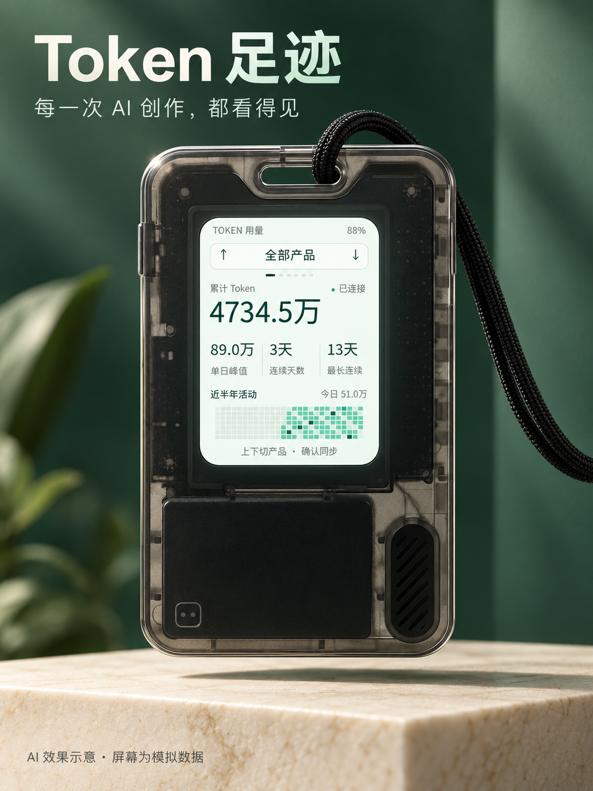
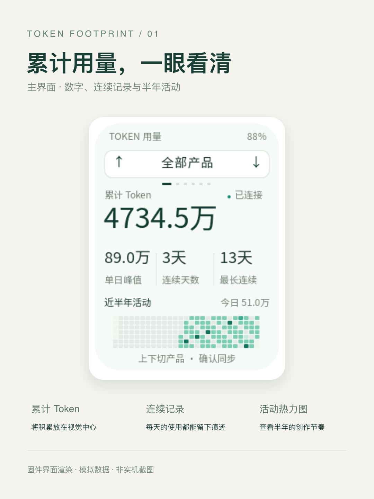
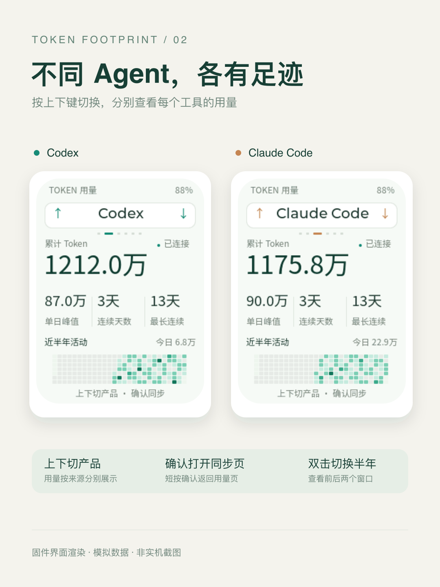

[简体中文](README.zh_CN.md) · **English**

<div align="center">

# Token Footprint

### See your AI work add up.

Automatic local collection. A clear dashboard. Your progress, in your pocket.

[Get started](#get-started) · [Supported agents](#supported-agents) · [Verify the numbers](#verify-the-numbers) · [Application guide](docs/token-dashboard.md)

   

</div>

<table>
  <tr>
    <td width="50%"></td>
    <td width="50%"></td>
  </tr>
</table>

*AI product illustrations based on the device's appearance. All displayed usage is synthetic.*

| Collect automatically | See the big picture | Keep it local |
| --- | --- | --- |
| Read compatible agent records every five seconds, without manual imports. | Explore cumulative tokens, daily peaks, streaks and half-year activity. | Run a localhost web dashboard and send aggregate statistics to the wearable over encrypted Bluetooth. |

## Get started

The desktop companion has been tested on **macOS**. Flash the [merged firmware](#build-and-flash) to your AI Passport first; the device needs no Wi-Fi setup. Use an AI tool on this same Mac so local usage records exist.

**1. Download the companion.**

Python **3.9+** is required. In Terminal, run `python3 --version` to check; if unavailable, use the [official macOS installer](https://www.python.org/downloads/macos/). Open [the source repository](https://github.com/alienzhou/token-dashboard), click **Code → Download ZIP**, and extract it. Locate the extracted folder containing `tools` and `companion`.

**2. Start it from Terminal.**

Open the Mac's **Terminal** app. Type `cd` followed by **one space**, drag the extracted project folder into the window, and press **Return**. This [inserts the folder's path](https://support.apple.com/guide/terminal/drag-items-into-a-terminal-window-trml106/mac) without typing it by hand. Then paste this command and press Return:

```bash
bash tools/run-token-dashboard.sh
```

Wait for the first-time dependency installation and allow Bluetooth access when prompted. A line displaying `http://127.0.0.1:8964` confirms startup. Keep Terminal open and leave this checkout in place: the macOS launcher depends on it.

**3. View and explore the dashboard.**

Open [127.0.0.1:8964](http://127.0.0.1:8964) in your browser. The first historical scan may take a little longer. Use the first tab beside the activity chart for all agents, or choose an agent name to filter the statistics; hover over a heatmap cell for its date and token count. The page shows connection status and the latest collection/sync time. Collection happens every five seconds while the companion runs.

**4. Pair the wearable.**

Turn on the Mac's Bluetooth and bring the device nearby. Hold **OK** on the device; the companion discovers it automatically. Enter the displayed six-digit code in the computer's pairing dialog. The web connection indicator reports automatic Bluetooth sync when synchronization succeeds. If the pairing window expires, cancel the old dialog and hold OK again. On the device, Up/Down switches agents, OK opens usage/sync, and double OK changes the half-year window. Web filtering and the device's selection are independent.

**5. Stop and resume.**

Continue using your AI tools normally. Press `Ctrl+C` in Terminal to stop the companion. Next time, repeat step 2; saved history resumes automatically. To collect and browse without Bluetooth, use `bash tools/run-token-dashboard.sh --no-ble` instead.

<details>
<summary>Already use Git?</summary>

```bash
git clone --branch feature/token-dashboard https://github.com/alienzhou/token-dashboard.git
cd token-dashboard
bash tools/run-token-dashboard.sh
```

</details>

## Your usage, at a glance

<table>
  <tr>
    <td width="50%"></td>
    <td width="50%"></td>
  </tr>
</table>

*These are source-rendered firmware views with synthetic test data, not on-device screenshots. [Native overview](docs/assets/token-dashboard/screens/all-agents.png) · [Codex](docs/assets/token-dashboard/screens/codex.png) · [Claude Code](docs/assets/token-dashboard/screens/claude-code.png)*

| Button | Action |
| --- | --- |
| Up / Down | Switch between all agents and individual tools |
| Press OK | Switch between usage and synchronization |
| Double-press OK | Switch the half-year activity window |
| Hold OK | Open the physical pairing window and show the six-digit code |

## Supported agents

| Agent | Automatic collection | Validation |
| --- | --- | --- |
| Codex | Compatible local usage records | Reconciled against real local records |
| Claude Code | Compatible local usage records | Schema fixtures |
| OpenCode | Compatible message storage; v2-only storage is unsupported | Schema fixtures |
| Gemini CLI | Compatible local usage records | Schema fixtures |
| Cursor | Currently unsupported | No reliable local adapter; no manual importer |

Availability depends on the records the tool actually writes. See [collection schemas and limitations](docs/token-dashboard.md) before interpreting missing data.

## Verify the numbers

```bash
python3 tools/audit_token_usage.py --url http://127.0.0.1:8964
```

The independent, read-only audit recomputes available Codex log records, reconciles them with the ledger, and checks the dashboard's total and daily values. It reports missing records, mismatches, duplicates, counter resets, retained history and initial cumulative baselines. When using a custom ledger, pass the same `--state` to the companion and audit.

**Logged usage is not provider billing or a subscription limit.** Some initial cumulative baselines predate the first visible event, so their original day cannot be reconstructed. Only Codex has been checked against real local records; the other adapters have fixture validation.

## Build and flash

<details>
<summary><strong>Firmware, validation and flashing details</strong></summary>

This is the complete ESP-IDF project with the reusable FoloToy BSP. Target: **ESP32-C3, 8 MB Flash, no PSRAM**, ESP-IDF **5.5.3**.

```bash
# Activate ESP-IDF 5.5.3 first.
./tools/validate.sh
```

The gate creates `build/FoloToy-AI-Passport-full.bin`, intended for flashing at **0x0**, and a matching immutable ELF/MAP bundle under `build/firmware/<SHA256>/`.

**The merged image clears existing NVS settings and Bluetooth bonds.** A whole-chip erase is unnecessary. Generated firmware is not committed.

Build and host checks passed for the tested firmware. Device flash and bounded startup checks passed; full pairing, display, power-loss and radio acceptance remain listed in the [validation report](docs/token-dashboard-validation.md). A successful build does not establish hardware validation.

</details>

## Explore the project

- [Application guide](docs/token-dashboard.md): collection, BLE synchronization, persistence and limitations.
- [Validation report](docs/token-dashboard-validation.md): exact tested firmware and remaining device checks.
- [Agent instructions](AGENTS.md): read before development. The application branch is `feature/token-dashboard`.

Only numerical metadata is collected. Prompts, code, credentials, personal ledgers, device logs and real-usage screenshots are excluded from Git.

Based on [FoloToy/ai-passport](https://github.com/FoloToy/ai-passport), retaining its [MIT license](LICENSE). Noto CJK fonts use [SIL OFL 1.1](assets/fonts/OFL.txt).
