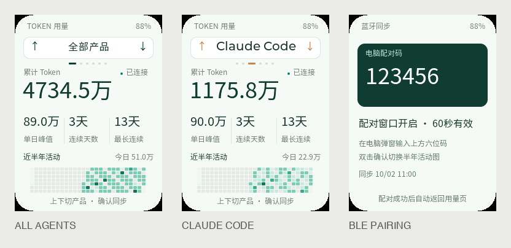

[简体中文](README.zh_CN.md) · **English**

# Token Dashboard for AI Passport

Collect local AI agent token usage automatically, view it in a local browser,
and synchronize aggregate statistics to a 240×320 AI Passport over encrypted BLE.
This repository includes the complete ESP-IDF project and reusable FoloToy BSP.



- Automatic adapters: Codex, Claude Code, OpenCode's compatible message storage,
  and Gemini CLI. Cursor is explicitly unsupported; no manual import is required.
- Every five seconds: incremental collection with a persistent, deduplicated
  ledger. A localhost dashboard shows totals, daily peak, streaks and activity.
- Wearable: up/down product selection, a prominent cumulative total, three
  secondary metrics, a half-year heatmap and six-digit BLE pairing.
- Local data only: numerical metadata is collected; prompts, code, credentials,
  personal databases, device logs and real-usage screenshots are excluded from Git.

## Run the desktop companion

Python 3.9+ is required. From the checkout root:

```bash
./tools/run-token-dashboard.sh
# Collection and local dashboard without Bluetooth:
./tools/run-token-dashboard.sh --no-ble
```

Open [the local dashboard](http://127.0.0.1:8964). Keep the companion running for
live collection. On macOS the script builds a local alias application with a
Bluetooth usage declaration; it depends on this checkout remaining in place.
First pairing requires long OK on the device and entering its displayed code
in the OS pairing dialog. Up/down switches products; OK opens synchronization;
double OK changes the calendar window.

## Verify the numbers

```bash
python3 tools/audit_token_usage.py --url http://127.0.0.1:8964
# If using a custom ledger, pass the same --state to the collector and audit.
```

The independent read-only audit reconciles available Codex log records with
the ledger and compares the panel's total and daily values. It reports missing
records, mismatches, duplicates, resets, retained history and initial cumulative
baselines. It does not equate logged token work with provider billing. Some
initial baselines predate the first visible event, so their original day cannot
be reconstructed. Only Codex has been checked against real local records;
other adapters currently have schema-fixture validation.

## Build and flash

Target: **ESP32-C3, 8 MB Flash, no PSRAM**, ESP-IDF **5.5.3**.

```bash
# Activate your ESP-IDF 5.5.3 environment first.
./tools/validate.sh
```

The gate creates `build/FoloToy-AI-Passport-full.bin` for flashing at **0x0** and
an immutable matching ELF/MAP bundle under `build/firmware/<SHA256>/`. The merged
image clears existing NVS/settings/bonds; no whole-chip erase is required.
Generated firmware is not committed.

See [the application guide](docs/token-dashboard.md) for collection schemas,
limitations, BLE and persistence; [validation results](docs/token-dashboard-validation.md)
for the exact tested artifact and remaining device checks; and [AGENTS.md](AGENTS.md)
before developing. Application development is on `feature/token-dashboard`.

Based on [FoloToy/ai-passport](https://github.com/FoloToy/ai-passport), retaining
its [MIT license](LICENSE). Noto CJK fonts use [SIL OFL 1.1](assets/fonts/OFL.txt).
